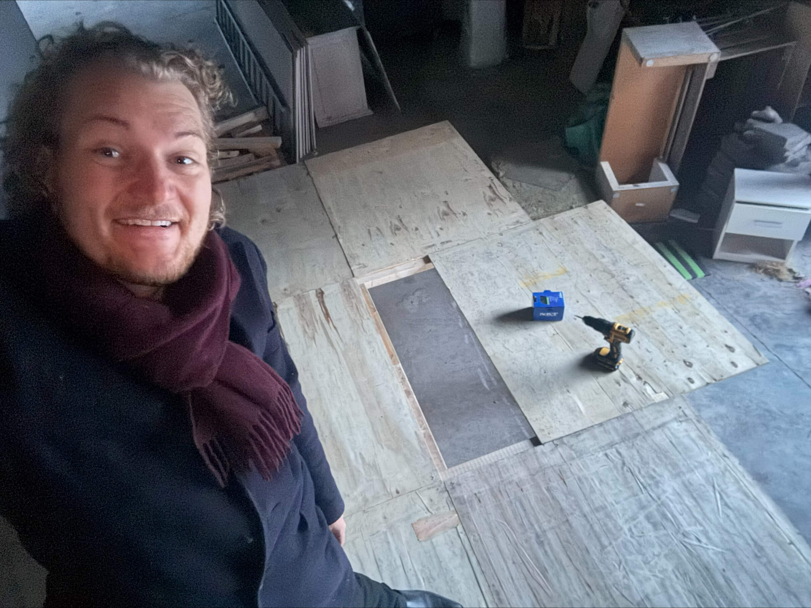

# Employee Spotlight: Martin

When Martin joined Dyalog last year, he confessed to a secret identity… beneath the
formal attire hides a medieval merchant! Twelve months later, we've noticed the
resemblance runs deeper than the tunic. Martin is, in fact, a bit like Batman. He
comes and goes at odd hours, responds best when there's a symbol in the sky (or a
ticket in the Technical Services queue!), and quietly solves problems wherever he
lands, from cable management in the Copenhagen office to overhauling Dyalog Ltd's
internal IT infrastructure. His one true nemesis remains the office printer, which
continues to resist all attempts at diplomacy. Replacing it may be next year's
headline project.

{ align=right width=250 }

Since arriving, Martin has taken on the behind-the-scenes work that makes everyone
else's day run smoother, from setting up home offices to gathering the Technical
Services team for their first conclave on collaboration. That variety is exactly what
he enjoys most. "I do everything IT-related. I hadn't changed printer toner or
installed a router since I was a trainee, so getting to mix that with writing
communication policies and migrating to Microsoft Exchange has been a lot of fun."

Coming from more corporate environments, Martin found Dyalog Ltd's culture to be a
refreshing change of thinking. "Everyone here is extremely passionate about what they
do, whether that's developing new features, keeping the IT environment healthy, or
making the business run smoothly. That energy is contagious, and it's something I
didn't know I was missing." What struck him most was the absence of a career ladder
to climb or internal competition to navigate. Instead, there's a flat hierarchy and
an open culture where everyone's opinion matters.

"I feel at home whether I'm in the office or working remotely. It's very much the
company culture, and one of the things I enjoy most about working here." Being based
in Denmark, most of Martin's collaboration happens with the team in Bramley, an
arrangement that suits him nicely. "Nine-to-five has never really been for me. I'm a
bit of a night owl, so being able to come in late and stay late has genuinely
improved my wellbeing."

Life outside the office has scaled up too. Over the past year, Martin has expanded his
Merchant's Guild. He now works more than one market at a time, and traded his central
Copenhagen apartment for a farmhouse, a plot of land, and several old stables. So,
when Martin is "on leave," he is definitely not relaxing with a drink in hand but
rather is out fixing the quirks of an old farmhouse, entertaining market guests, and
adding to the general, glorious, chaos of it all.

After his first twelve months, his guiding philosophy hasn't changed. "Technology
should make life easier, not more complicated. I can't develop features for the
interpreter or decide the direction for APL, but if I can make the developers' lives
a little easier so that they can focus on what they're brilliant at, then that's
success for me!"

The first year has gone by in a whirl, and Martin is looking forward to many more,
plenty of projects to dive into, lots of debates to be had, and a Copenhagen office
fridge full of Coke that is unlikely to empty itself.

