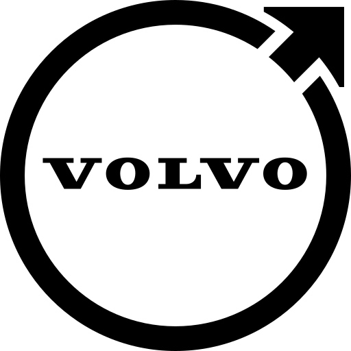
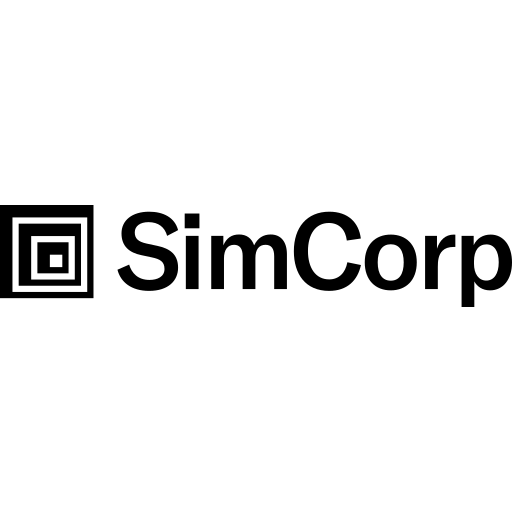
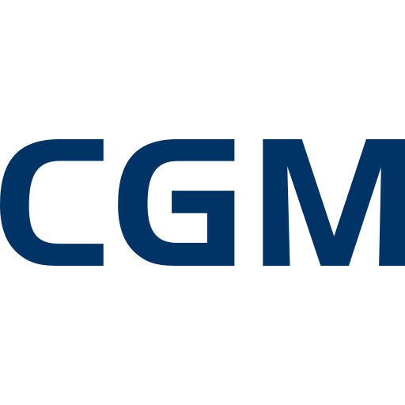

<div class="mdx-trusted" markdown="1">

## Trusted for over 40 years { #trusted }

Dyalog is used by organisations worldwide to build and run important business
systems.

<p class="mdx-logos">
<a href="https://www.investcloud.com/" title="InvestCloud" target="_blank" rel="noopener"></a>
<a href="https://www.volvocars.com/" title="Volvo Cars" target="_blank" rel="noopener"></a>
<a href="https://www.simcorp.com/" title="SimCorp" target="_blank" rel="noopener"></a>
<a href="https://www.ergo.com/" title="ERGO" target="_blank" rel="noopener"></a>
<a href="https://www.cgm.com/" title="CGM" target="_blank" rel="noopener"></a>
<a href="https://www.metsim.com/" title="METSIM" target="_blank" rel="noopener"></a>
</p>

> We like to think of APL as our secret weapon. And yes, we know it's a bit unfair
> to the competition.
>
> — Tomas Gustafsson, [Stormwind Ab Oy](https://stormwind.fi/en/)

</div>

## Less code you say? { #less-code }

APL works on whole arrays at once, so tasks that need loops and bookkeeping in
most languages collapse into a single expression.<br>
Pick a problem and a language, and compare!

=== "Sum a list of numbers"

    <div class="mdx-pair" markdown="1">

    === "JavaScript"

        ```js
        const lstSum = lst => lst.reduce((a, b) => a + b, 0);
        
        lstSum([3, 1, 4, 1, 5])  // 14
        ```

    === "Python"

        ```python
        import numpy as np
        
        def LstSum(lst):
          return np.sum(lst)  
        
        LstSum([3, 1, 4, 1, 5])  # 14
        ```

    === "Rust"

        ```rust
        use std::iter::Sum;
        
        fn lst_sum<T: Copy + Sum>(vals: &[T]) -> T {
            vals.iter().copied().sum()
        }
        
        lst_sum(&[3, 1, 4, 1, 5])  // 14
        ```

    === "Go"

        ```go
        func LstSum(xs []int) int {
        	s := 0
        	for _, x := range xs {
        		s += x
        	}
        	return s
        }
        
        func main() {
        	LstSum([]int{3, 1, 4, 1, 5})
        }
        ```

    === "Clojure"

        ```clojure
        (def sum-list (partial reduce +))
        
        (sum-list [3 1 4 1 5]) ;; 14
        ```

    === "Haskell"

        ```haskell
        lstSum :: Num a => [a] -> a
        lstSum = sum
        
        main :: IO ()
        main = do
            print $ lstSum [3, 1, 4, 1, 5] -- 14
        ```

    <!-- split: APL as its own single-tab set -->

    === "Dyalog APL"

        ```apl
              LstSum←+⌿
        
              LstSum 3 1 4 1 5
        14
        ```

    </div>

=== "Sum each column of a table"

    <div class="mdx-pair" markdown="1">

    === "JavaScript"

        ```js
        const colSum = mat =>
          mat.reduce((a, r) => a.map((x, j) => x + r[j]));
        
        colSum([[3, 1], [4, 1], [5, 9]])  // [12,11]
        ```

    === "Python"

        ```python
        import numpy as np
        
        def ColSum(lst):
          return np.array(lst).sum(axis=0)  
        
        ColSum([[3, 1], [4, 1], [5, 9]])  # [12 11]
        ```

    === "Rust"

        ```rust
        use std::iter::Sum;
        
        fn col_sum<T: Copy + Sum>(table: &[Vec<T>]) -> Vec<T> {
            (0..table[0].len()).map(|j| table.iter().map(|r| r[j]).sum()).collect()
        }
        
        col_sum(&vec![vec![3, 1], vec![4, 1], vec![5, 9]])  // [12 11]
        ```

    === "Go"

        ```go
        func ColSum(table [][]int) []int {
        	out := make([]int, len(table[0]))
        	for _, row := range table {
        		for j, x := range row {
        			out[j] += x
        		}
        	}
        	return out
        }
        ```

    === "Clojure"

        ```clojure
        (def sum-cols #(apply mapv + %))
        
        (sum-cols [[3 1] [4 1] [5 9]]) ;; [12 11]
        ```

    === "Haskell"

        ```haskell
        colSum :: Num a => [[a]] -> [a]
        colSum [] = []
        colSum xs = foldr1 (zipWith (+)) xs
        
        main :: IO ()
        main = do
            print $ colSum [[3, 1], [4, 1], [5, 9]] -- [12,11]
        ```

    <!-- split: APL as its own single-tab set -->

    === "Dyalog APL"

        ```apl
              ColSum←+⌿
        
              ColSum [3 1
                      4 1
                      5 9]
        12 11
        ```

    </div>

=== "Windowed sum of a list"

    <div class="mdx-pair" markdown="1">

    === "JavaScript"

        ```js
        const winSum = (vals, win) => {
          const pre = [0];
          vals.forEach(x => pre.push(pre.at(-1) + x));
          return pre.slice(win).map((s, i) => s - pre[i]);
        };
        
        winSum([3, 1, 4, 1, 5], 2)  // [4, 5, 5, 6]
        winSum([3, 1, 4, 1, 5], 3)  // [8, 6, 10]]
        ```

    === "Python"

        ```python
        import numpy as np
        
        def WinSum(vals, window):
            return np.convolve(vals, np.ones(window, dtype=int), 'valid')
        
        WinSum([3, 1, 4, 1, 5], 2)  # [4 5 5 6]
        WinSum([3, 1, 4, 1, 5], 3)  # [8 6 10]
        ```

    === "Rust"

        ```rust
        use std::iter::Sum;
        
        fn win_sum<T: Copy + Sum>(vals: &[T], window: usize) -> Vec<T> {
            vals.windows(window).map(|w| w.iter().copied().sum()).collect()
        }
        
        win_sum(&[3, 1, 4, 1, 5], 2)  // [4 5 5 6]
        win_sum(&[3, 1, 4, 1, 5], 3)  // [8 6 10]
        ```

    === "Go"

        ```go
        func WinSum(xs []int, window int) []int {
        	out := make([]int, 0, len(xs)-window+1)
        	for i := 0; i+window <= len(xs); i++ {
        		out = append(out, LstSum(xs[i:i+window]))
        	}
        	return out
        }
        ```

    === "Clojure"

        ```clojure
        (defn win-sum [n xs] (->> xs (partition n 1) (map #(apply + %))))
        
        (win-sum 2 [3 1 4 1 5]) ;; (4 5 5 6)
        (win-sum 3 [3 1 4 1 5]) ;; (8 6 10)
        ```

    === "Haskell"

        ```haskell
        window :: Int -> [a] -> Maybe [a]
        window 0 [] = Just []
        window _ [] = Nothing
        window 0 _  = Just []
        window n (x : xs)
            | n < 0     = Nothing
            | otherwise = (x :) <$> window (n - 1) xs
        
        winSum :: Num a => Int -> [a] -> [a]
        winSum n xs = case window n xs of
            Just window -> lstSum window : (winSum n $ tail xs)
            Nothing     -> []
        
        main :: IO ()
        main = do
            print $ winSum 2 [3, 1, 4, 1, 5] -- [4,5,5,6]
            print $ winSum 3 [3, 1, 4, 1, 5] -- [8,6,10]
        ```

    <!-- split: APL as its own single-tab set -->

    === "Dyalog APL"

        ```apl
              WinSum←+⌿
        
              2 WinSum 3 1 4 1 5
        4 5 5 6
              3 WinSum 3 1 4 1 5
        8 6 10
        ```

    </div>

=== "Sum adjacent table rows"

    <div class="mdx-pair" markdown="1">

    === "JavaScript"

        ```js
        const atrSum = mat =>
          mat.slice(1).map((row, i) => row.map((x, j) => x + mat[i][j]));
        
        atrSum([[3, 1], [4, 1], [5, 9]])  // [[7, 2], [9, 10]]
        ```

    === "Python"

        ```python
        import numpy as np
        
        def ATRSum(table, window):
            return sum(table[i : i + len(table) - window + 1] for i in range(window))
        
        ATRSum(np.array([[3, 1], [4, 1], [5, 9]]), 2)  # [[7 2] [9 10]]
        ```

    === "Rust"

        ```rust
        use std::ops::AddAssign;
        
        fn atr_sum<T: Copy + AddAssign>(table: &[Vec<T>], window: usize) -> Vec<Vec<T>> {
            let mut acc = table[..table.len() - window + 1].to_vec();
            for offset in 1..window {
                for (row, src) in acc.iter_mut().zip(&table[offset..table.len() - window + 1 + offset]) {
                    for (a, &x) in row.iter_mut().zip(src) {
                        *a += x;
                    }
                }
            }
            acc
        }
        
        atr_sum(&vec![vec![3, 1], vec![4, 1], vec![5, 9]], 2)  // [[7 2] [9 10]]
        ```

    === "Go"

        ```go
        func ATRSum(table [][]int, window int) [][]int {
        	out := make([][]int, 0, len(table)-window+1)
        	for i := 0; i+window <= len(table); i++ {
        		out = append(out, ColSum(table[i:i+window]))
        	}
        	return out
        }
        ```

    === "Clojure"

        ```clojure
        (defn col-sum
          [n rows]
          (mapv
            #(apply mapv + %)
            (partition n 1 rows)))
        
        (col-sum 2 [[3 1] [4 1] [5 9]]) ;; [[7 2] [9 10]]
        ```

    === "Haskell"

        ```haskell
        window :: Int -> [a] -> Maybe [a]
        window 0 [] = Just []
        window _ [] = Nothing
        window 0 _  = Just []
        window n (x : xs)
            | n < 0     = Nothing
            | otherwise = (x :) <$> window (n - 1) xs
        
        atrSum :: Num a => Int -> [[a]] -> [[a]]
        atrSum n xs = case window n xs of
            Just window -> colSum window : (atrSum n $ tail xs)
            Nothing     -> []
        
        main :: IO ()
        main = do
            print $ atrSum 2 [[3, 1], [4, 1], [5, 9]] -- [[7,2],[9,10]]
        ```

    <!-- split: APL as its own single-tab set -->

    === "Dyalog APL"

        ```apl
              ATRSum←+⌿
        
              2 ATRSum [3 1
                        4 1
                        5 9]  
        [7  2
         9 10]
        ```

    </div>

=== "Sum rows of mixed-type table"

    <div class="mdx-pair" markdown="1">

    === "JavaScript"

        ```js
        const mixSum = mat =>
          mat.reduce((acc, row) => acc.map((c, i) => {
            const d = row[i];
            return Array.isArray(c) ? (Array.isArray(d) ? c.map((x, j) => x + d[j])
                                                        : c.map(x => x + d))
                 : Array.isArray(d) ? d.map(y => c + y)
                 : c + d;
          }));
        
        mixSum([[1, 2, 3], [[1, 2], [4, 5], [5, 6]]])  // [[2, 3], [6, 7], [8, 9]]
        ```

    === "Python"

        ```python
        import numpy as np
        
        def MixSum(arr):
          return np.sum(arr, axis=0)
        
        m = np.empty((2, 3), dtype=object)
        m[:] = [
            [1,                2,                3               ],
            [np.array([1, 2]), np.array([4, 5]), np.array([5, 6])]
        ]
        
        MixSum(m)  # array([array([2, 3]), array([6, 7]), array([8, 9])], dtype=object)
        ```

    === "Rust"

        ```rust
        use std::ops::Add;
        
        fn mix_sum<T: Copy + Add<Output = T>>(scalars: &[T], pairs: &[(T, T)]) -> Vec<(T, T)> {
            scalars.iter().zip(pairs).map(|(&s, &(x, y))| (s + x, s + y)).collect()
        }
        
        mix_sum(&[1, 2, 3], &[(1, 2), (4, 5), (5, 6)])  // [(2 3) (6 7) (8 9)]
        ```

    === "Go"

        ```go
        func add(a, b any) any {
        	xs, aVec := a.([]int)
        	ys, bVec := b.([]int)
        	if !aVec && !bVec {
        		return a.(int) + b.(int)
        	}
        	n := max(len(xs), len(ys))
        	if !aVec {
        		xs = slices.Repeat([]int{a.(int)}, n)
        	}
        	if !bVec {
        		ys = slices.Repeat([]int{b.(int)}, n)
        	}
        	out := make([]int, n)
        	for i := range out {
        		out[i] = xs[i] + ys[i]
        	}
        	return out
        }
        
        func MixSum(table [][]any) []any {
        	acc := append([]any(nil), table[0]...)
        	for _, row := range table[1:] {
        		for i := range acc {
        			acc[i] = add(acc[i], row[i])
        		}
        	}
        	return acc
        }
        ```

    === "Clojure"

        ```clojure
        (defn mix-sum [rows]
          (letfn [(ext [x]   (if (sequential? x) x (repeat x)))
                  (p+  [a b] (if (or (sequential? a) (sequential? b))
                               (mapv p+ (ext a) (ext b))
                               (+ a b)))]
            (reduce p+ rows)))
        
        (mix-sum [[1 2 3] [[1 2] [4 5] [5 6]]]) ;; [[2 3] [6 7] [8 9]]
        ```

    === "Haskell"

        ```haskell
        data Mix a = One a | Many [a] deriving (Eq, Show)
        
        mixSum :: Num a => [[Mix a]] -> [Mix a]
        mixSum []  = []
        mixSum xs = foldr1 mixPlus xs
          where
            mixPlus = zipWith
                (\x y -> case (x, y) of
                    (One  x, One  y) -> One  $ x + y
                    (One  x, Many y) -> Many $ map (x +) y
                    (Many x, One  y) -> Many $ map (+ y) x
                    (Many x, Many y) -> Many $ zipWith (+) x y
                )
        
        main :: IO ()
        main = do
        	print $ mixSum
        		[ [One 1,       One 2,       One 3]
        		, [Many [1, 2], Many [4, 5], Many [5, 6]]
        		]
        	-- [Many [2,3],Many [6,7],Many [8,9]]
        ```

    <!-- split: APL as its own single-tab set -->

    === "Dyalog APL"

        ```apl
              MixSum←+⌿
        
              MixSum [  1    2    3
                      (1 2)(4 5)(5 6)]
        (2 3)(6 7)(8 9)
        ```

    </div>

## What's happening { #whats-happening }

<div class="grid cards" markdown>

-   <span class="card-eyebrow">Competitions</span>

    [__Winners of the APL Forge 2026 Announced__](news/2024-apl-forge-winners.md)

    Meet the two winners of the 2026 APL Forge and the projects that earned them
    top honours.

-   <span class="card-eyebrow">Events</span>

    [__Registration open for Dyalog '26__](https://usermeeting.dyalog.com)

    Join us in Eastbourne, UK, from 12–16 October to exchange ideas, learn, and
    meet the Dyalog team.

-   <span class="card-eyebrow">Team Dyalog</span>

    [__Asher, welcome to Dyalog__](about/team-dyalog/asher-harvey-smith.md)

    Meet Asher Harvey-Smith, a Dyalog developer working on the interpreter,
    performance, and correctness.

-   <span class="card-eyebrow">Competitions</span>

    [__Take the APL Challenge__](learn/apl-challenge.md)

    Join the APL Challenge and transform ideas into code. Not a programmer? No
    problem! We'll guide you.

-   <span class="card-eyebrow">Blog</span>

    [__Employee Spotlight: Martin__](blog/2026/08/employee-spotlight-martin.md)

    Martin Franck has reached his first year anniversary with Dyalog Ltd, and this
    blog post looks at how he's found his first twelve months.

-   <span class="card-eyebrow">Blog</span>

    [__Working with LLMs and Dyalog__](blog/2026/07/working-with-llms-and-dyalog.md)

    Stefan Kruger outlines how he utilises LLMs when working with APL. He describes
    his set-up and working practices, and provides a few practical tips on how to
    make an LLM more fluent in APL.

</div>
