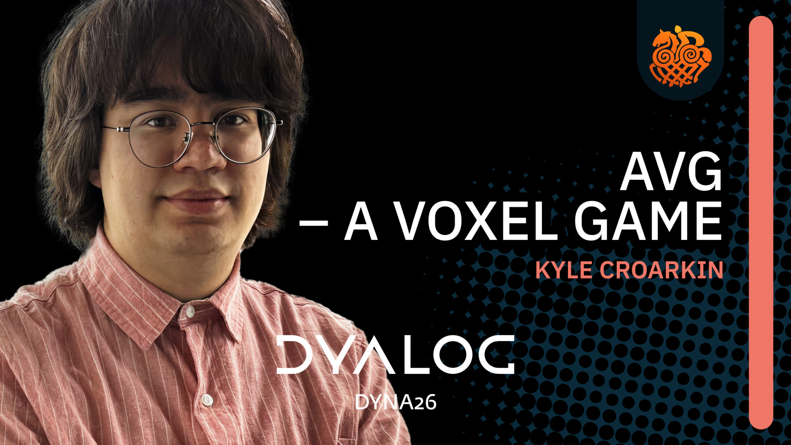
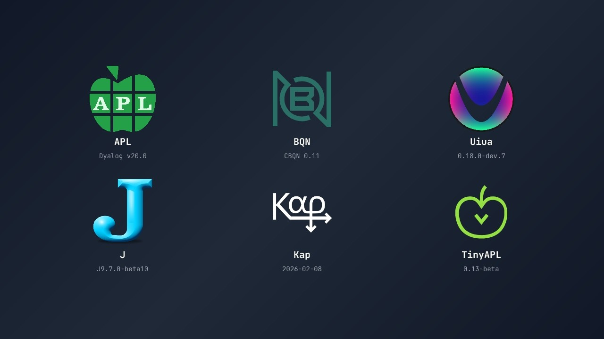

# APL Forge: 2026 Winners Announced

*29 July 2026*

The [APL Forge](https://dyalogprod.gos.dyalog.com/learn/apl-forge/) is an initiative
that is intended as a catalyst to grow the next generation of APL-based applications
and tools by inspiring people with good ideas to use APL to turn those ideas into
reality.

This annual competition asks individuals, groups, or even companies, to submit their
open-source libraries or potential commercial applications/tools for assessment.
Each submission can be proprietary or permissively licensed, and open- or
closed-sourced, but the core must be written in a currently-supported version of
Dyalog (see [full eligibility criteria](https://forge.dyalog.com/eligibility-judging-criteria/)).

The 2026 round of the APL Forge closed in June; the judging process has now completed
and two winners were selected – Kyle Croarkin won the APL category with his
Minecraft-style game [AVG](https://github.com/namgyaaal/avoxelgame/) and Conor
Hoekstra won the non-APL category with his interactive expression builder
[ArrayBox](https://arraybox.dev/).

## Kyle Croarkin

{ align=right width=280 }

"I recently graduated from the [University of Illinois Urbana-Champaign](https://illinois.edu/)
with a degree in Computer Science and Linguistics, and am now a Graduate Research
Assistant at [Mayo Clinic](https://www.mayoclinic.org/) while I decide on my plans
for graduate school. My current research encompasses data science, machine learning,
and natural language processing, and I also have a passion for graphics programming
and game development that was inspired by wanting to modify Minecraft and other games
at a young age.

"I discovered APL in August 2025. I was quickly fascinated by it and wondered how it
could be used to make wider applications. My initial investigations included looking
at Brian Ellingsgaard's [Dyalog '24 presentation on raylib-apl](https://www.youtube.com/watch?v=aSSub9-CBD8)
(a simple cross-platform library for graphics, sound, interactivity, and more) as
well as seeing how concisely he had implemented Tetris using APL. I decided that a
voxel game like Minecraft, a game where the world is composed of blocks that you can
break or destroy and move around in, would be the perfect fit for APL's notation in
a low level graphics library.

"After a few months of studying APL, I felt confident to start this project. Although
there was a lot of work, experimentation and studying the documentation to get what
I wanted, I was amazed that things that would have taken me dozens of lines in C++ or
Rust could be concisely done in a few lines of APL. Things like collision detection,
frustum culling (performance optimisation in 3D graphics), and converting blocks to
geometrical representation could be done significantly more concisely whilst
maintaining good performance. More surprisingly was how well I was able to reason and
work on my APL code, constantly iterating it and modifying it to improve it. It was
amusing that something that started out as an experiment quickly made me appreciate
and even prefer the language!

"This project has been a lot of fun and I intend to continue to develop it alongside
potentially attempting to create a commercial game in APL if the time permits."

## Conor Hoekstra

{ align=right width=280 }

"I am currently a research scientist at NVIDIA, as well as being a YouTuber and
podcaster. I have four podcasts including ArrayCast which is a podcast about array
languages (APL, J, BQN and others) and my YouTube channel often covers content on
array languages as well. My biography / linktree with links to all of my podcasts,
videos and other content can be found here: [conorshakory.com](https://conorshakory.com/).

"I discovered and fell in love with APL in December of 2019. Before then, I had heard
of APL a number of times. The first was in 2010, when I was studying Actuarial Science
at [Simon Fraser University](https://www.sfu.ca/) and it was mentioned in an actuarial
course called ACMA 320. If you want more details on the 2010 to 2019 period when APL
came up several more times, I talk about it for approximately 7 minutes at the 8:50
minute mark of my [Twin Algorithms](https://www.youtube.com/live/NiferfBvN3s) talk
that I gave back in 2022. In 2019 I finally started exploring the language properly
using [tryapl.org](http://tryapl.org/), and instantly fell in love.

"[ArrayBox.dev](http://arraybox.dev/) has been a website I have been thinking about
since I discovered the array languages. There are many online REPLs for array
languages, and all of them have their faults. What I wanted was a one-stop-shop where
I could switch between APL, BQN, J, TinyAPL, Kap, and Uiua. I wanted inline
documentation, keyboard mappings, primitive search, syntax highlighting, code
formatting, inline train trees, and more, all in the same place. This is what
[ArrayBox.dev](http://arraybox.dev/) is. You can get a feel for this site by watching
this [introduction video](https://www.youtube.com/watch?v=L9ERBfKFSDU) and it is
completely open source (MIT License), so if there is a feature that you want to add,
you can contribute at [github.com/codereport/array-box](https://github.com/codereport/array-box)."

Congratulations Kyle and Conor!
